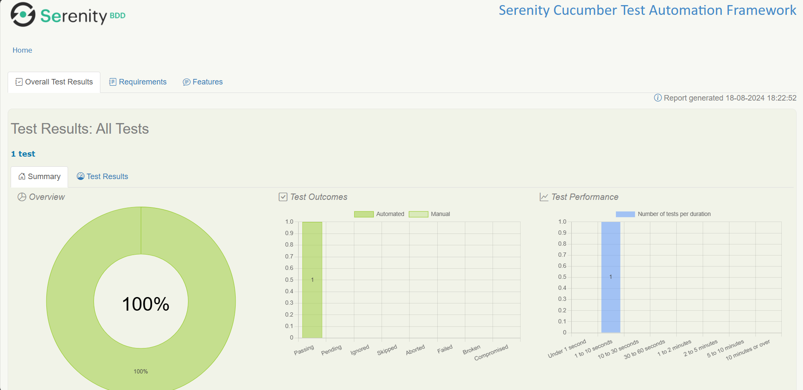
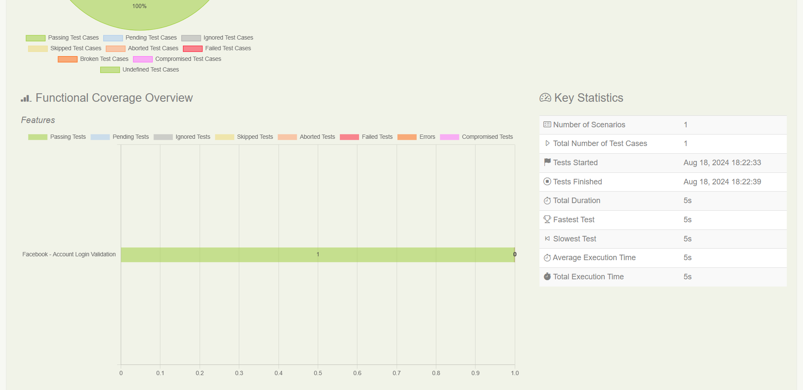
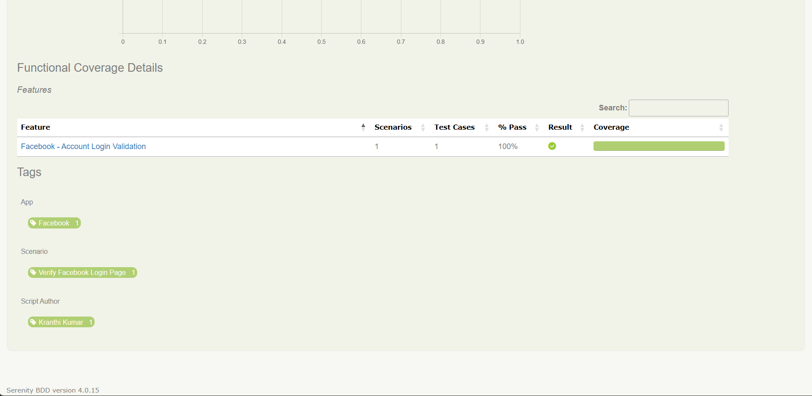
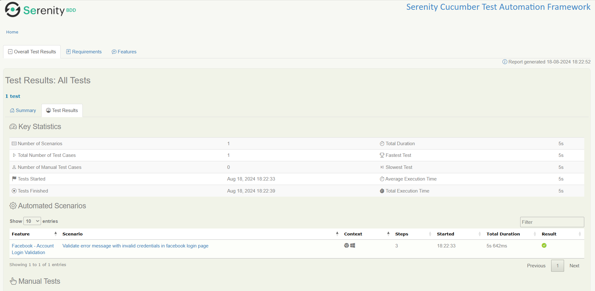
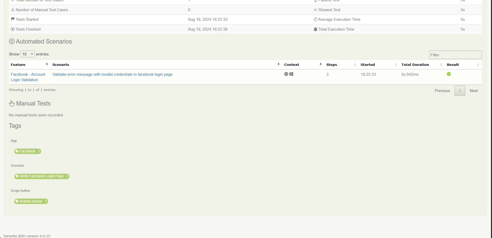
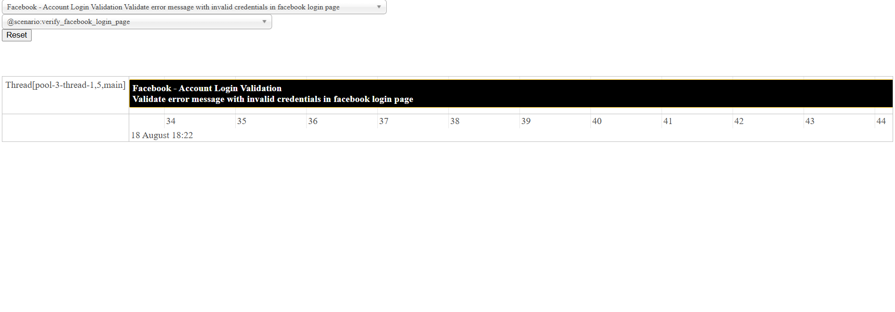

SERENITY CUCUMBER TEST AUTOMATION FRAMEWORK

# Maven Command to Execute Cucumber Feature File:
- mvn verify -Dcucumber.filter.tags=@scenario:verify_facebook_login_page -DexecutionThreadCount=1 -f C:\Users\PathToFolder\pom.xml

# Framework Setup:
- Java 17
- Intellij
- Maven
- Cucumber for Java Plugin
- Gherkin Plugin

# Test Output:

- target/site/serenity/index.html

- target/test-results

